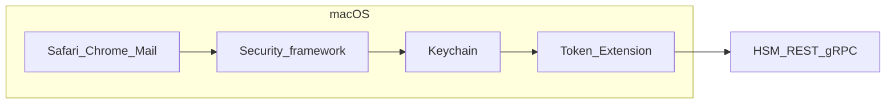

# Plano: certificado no Keychain (macOS) com chave privada remota (HSM via REST/gRPC)

## Contexto técnico

- **Objetivo:** o certificado aparecer na lista de identidades/certificados do Keychain e ser escolhível para **TLS mútuo** e usos similares em apps que usam **Security.framework** / Keychain.
- **Restrição:** a chave privada **não** está no Mac; operações ocorrem no **HSM**, acessível por **REST/gRPC**.
- **Implicação:** não basta “instalar só o certificado público”. Clientes TLS precisam de uma **SecIdentity** (ou equivalente exposto ao Keychain) em que a **chave privada seja uma chave de token** — o sistema chama o seu código para assinar durante o handshake.

O mecanismo oficial da Apple para isso é **[CryptoTokenKit](https://developer.apple.com/documentation/cryptotokenkit)** com uma **extensão de tipo Token** (Token Extension), implementando um `**TKTokenDriver`** / sessão de token que faz de ponte entre o Keychain e o seu backend.

## Passo a passo de implementação

### 1. Fechar o contrato com o HSM (API e semântica)

- Definir como o backend expõe: **certificado X.509 (DER/PEM)**, **ID da chave/certificado**, e operações necessárias para TLS cliente (tipicamente **assinatura** com algoritmos usados em certificados — ex.: RSA-PKCS#1 v1.5 / PSS, ECDSA conforme o certificado).
- Definir **autenticação** ao HSM (token OAuth, mTLS do agente, etc.) e **política de sessão** (timeout, retry, offline).
- **Importante:** mapear cada operação que o macOS pode solicitar durante TLS (e possivelmente outras) para chamadas concretas ao HSM; sem isso, o handshake falha mesmo com o certificado visível.

### 2. Desenhar o produto (UX e modelo de “token”)

- Decidir quando o “token” existe: ex. após login no app hospedeiro, após VPN, ou enquanto um daemon/agente estiver conectado ao HSM.
- Decidir **escopo**: itens por usuário (login keychain) vs. política de empresa (MDM/perfil) se aplicável.
- Prever **falha de rede**: o certificado pode aparecer, mas assinatura falhará — mensagens e logs claros ajudam suporte.

### 3. Criar o pacote macOS (app hospedeiro + extensão)

- Projeto Xcode com:
  - **App principal** (configuração, login ao HSM, listagem opcional, diagnóstico).
  - **Extension**: tipo **CryptoTokenKit** / **Token** (conforme template atual do Xcode para token drivers).
- Configurar **Signing & Capabilities**: App ID da extensão, **App Groups** ou outro canal se precisar compartilhar estado (token de sessão, URL do HSM) entre app e extensão com segurança.
- Adicionar **Network Client** (ou equivalente) na extensão se ela for falar com REST/gRPC diretamente; validar restrições de sandbox.

### 4. Implementar o driver de token (núcleo da integração Keychain)

- Subclass de `**TKTokenDriver`**: registrar/remover o token quando o HSM estiver “disponível” (ex.: sessão válida no app).
- Implementar `**TKToken`** / `**TKTokenSession**` (e classes associadas da família CTK para chaves e certificados no Keychain — seguir o fluxo do template Apple) para:
  - **Publicar** o(s) certificado(s) como itens visíveis no Keychain.
  - Associar **chaves privadas lógicas** ao token de forma que, ao usar identidade para TLS, o sistema invoque a extensão para **assinar** o digest/handshake.
- Garantir identificadores estáveis (para o mesmo certificado/chave no HSM) para não duplicar entradas a cada reconexão, quando possível.

### 5. Implementar a ponte REST/gRPC na extensão

- Na rotina de **assinatura** (e qualquer outra operação exigida pelo algoritmo/chave), serializar o pedido do formato esperado pelo Security framework e chamar o HSM.
- Tratar **latência** e **erros** (timeouts curtos podem quebrar TLS; definir limites realistas).
- **Logging**: os logs da extensão são essenciais para depurar falhas em Safari vs. no app.

### 6. Testes incrementais

- Teste unitário/integration do cliente HSM **fora** da extensão quando possível (menor atrito).
- Com o token ativo: `**security find-identity`** / seu PoC em [keyChainTestCommand/main.swift](keyChainTestCommand/main.swift) para ver se a identidade aparece.
- **TLS:** servidor de teste com **mTLS** (ex. `openssl s_server` ou nginx) e Safari/Chrome acessindo o site; capturar falhas de handshake.
- Regredir cenários: HSM fora do ar, token expirado, rotação de certificado.

### 7. Distribuição e operações

- **Notarização** e assinatura do app + extensão; documentar instalação para usuários finais.
- Se for uso corporativo: avaliar **MDM** para instalar o app e políticas de confiança no certificado (cadeia / âncoras), se necessário.

## Riscos e limitações a aceitar de propósito

- **Dependência de rede** em todo handshake que use essa identidade; indisponibilidade do HSM = falha de autenticação TLS.
- Comportamento **por app** pode variar em detalhes (por exemplo, alguns fluxos podem cachear escolhas); o núcleo continua sendo Keychain + CTK.
- Se no futuro o fornecedor oferecer **PKCS#11** no Mac, pode haver caminho alternativo (middleware ou integração já pronta), mas com **REST/gRPC** o CTK como proxy é o alinhamento típico com o modelo da Apple.

## Referências

- [CryptoTokenKit](https://developer.apple.com/documentation/cryptotokenkit)
- Documentação e exemplos Apple para **token extensions** (criação de extensão CryptoTokenKit no Xcode)

